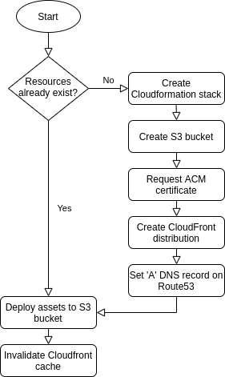

<h1 align="center">
  <br>
  Deploy static site to AWS
  <br>
</h1>

<h4 align="center">Batteries-included Github action that deploys a static site to AWS Cloudfront, taking care of DNS, SSL certs and S3 buckets</h4>

<div align="center">
  
</div>

## Usage
```
- name: Deploy
  uses: onramper/action-deploy-aws-static-site@v1
  with:
    AWS_ACCESS_KEY_ID: ${{ secrets.AWS_ACCESS_KEY_ID }}
    AWS_SECRET_ACCESS_KEY: ${{ secrets.AWS_SECRET_ACCESS_KEY }}
    domain: subdomain.example.com
    publish_dir: ./public
```
